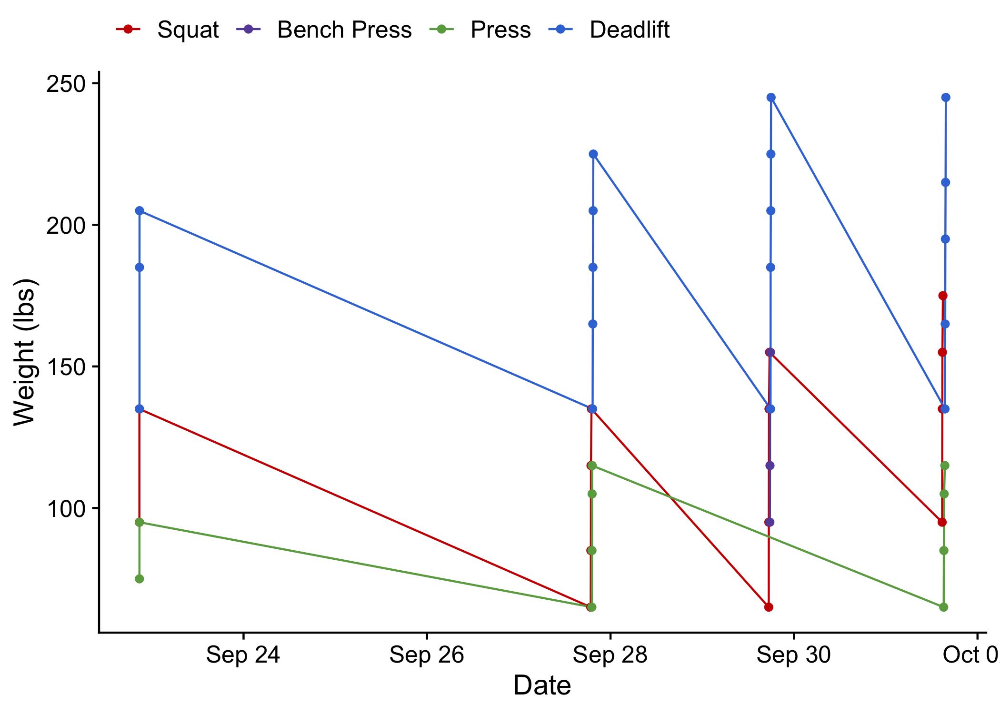
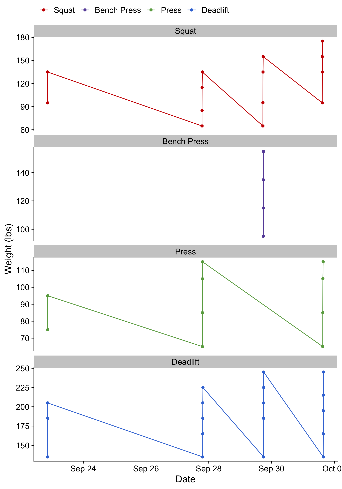

# startingstrength

Resources and data analysis of strength training exercises

## Programming

[Schedule and Warm-Up Routine](https://docs.google.com/spreadsheets/d/1SyOB_r6XOENmAunPZwkslgBb2Ltgzxn3EmezelEKQ5s/edit?usp=sharing)

## Technique

* [Learning to Squat](https://www.youtube.com/watch?v=nhoikoUEI8U)
* [Learning to Press](https://www.youtube.com/watch?v=8dacy5hjaE8)
* [Learning to Bench Press](https://www.youtube.com/watch?v=rxD321l2svE)
* [Learning to Deadlift](https://www.youtube.com/watch?v=p2OPUi4xGrM)
* [How to Do Weighted Chin Ups](https://www.youtube.com/watch?v=9aA0-FbxK9E)
* [How to Do The Lifts](https://www.youtube.com/playlist?list=PLNhFKPjedRnQ_qs4ID5gl3OoSxZFFZEHJ) for detailed power clean instructions.

## Data

[CSV data file](https://docs.google.com/spreadsheets/d/1F2IPfClwYT3qm4VbRAwbtanyX0AFURBW-uvPVcoMV-8/edit?usp=sharing) produced by Google Form and used for visualization

## Visualization

### Maximum Strength Progression

### Strength Progression with Warm-Ups

### Maximum Strength Progression by Exercise

