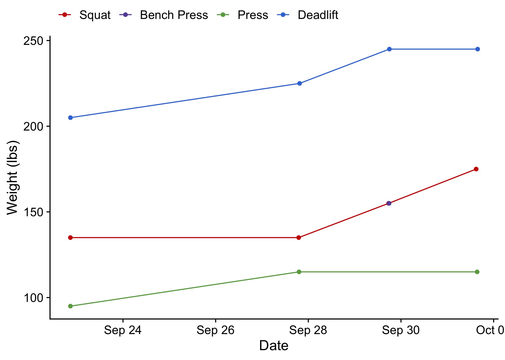
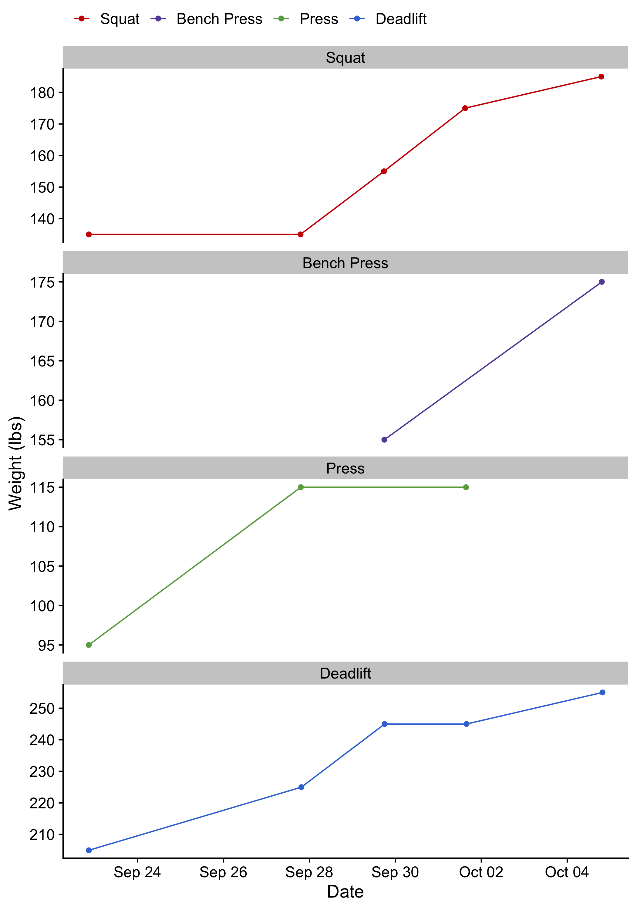

# startingstrength

Data analysis of strength training exercises

## Programming

Programming details can be referenced at [this sheet](https://docs.google.com/spreadsheets/d/1SyOB_r6XOENmAunPZwkslgBb2Ltgzxn3EmezelEKQ5s/edit?usp=sharing).

## Technique

* [Learning to Press](https://www.youtube.com/watch?v=8dacy5hjaE8)

## Data

A google form was used to document strength progress. Data visualizations are created from the following .csv file on [google drive](https://docs.google.com/spreadsheets/d/1F2IPfClwYT3qm4VbRAwbtanyX0AFURBW-uvPVcoMV-8/edit?usp=sharing).

## Strength Progression with Warm-Ups

### Overall

### By Exercise

## Maximum Strength Progression

### Max Overall

### Max by Exercise

